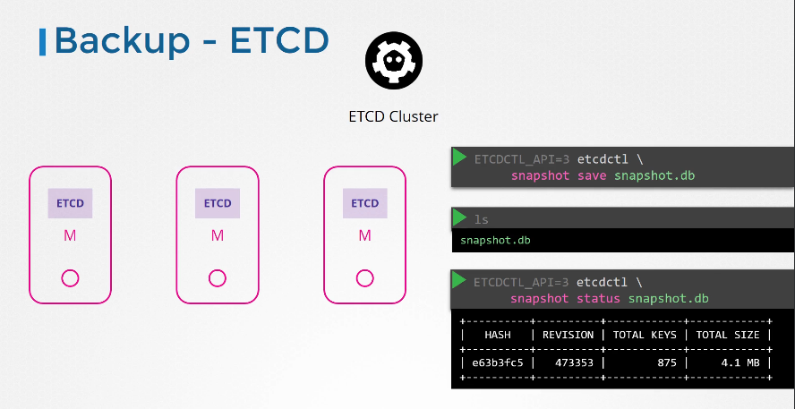

# Cluster Maintenance Steps

O processo de atualização do cluster se dá em dois passos, primeiro atualizar os master nodes e em seguida
os workers nodes
Mesmo com o master inativo durante o processo de atualização os worker nodes continuam funcionando
não impactando os usuarios que acessam as aplicações e somente não é possivel criar novos recursos, deletar os existentes e interagir com a apiserver com o
kubectl por exemplo.
Após os master node serem atualizados o proxim3o passo e atualizar os worker nodes e podemos adotar as seguintes estrategias, atualizar cada nó por vez transferindo todos os workloads
para os outros nós ou criar novas VMs já atualizadas, transferir os recursos e em seguida deletar o nó com a versão antiga.

## OS Upgrade


### 1 - Drain the node

    Antes de realizar qualquer atualização/manutenção em um nó de forma segura é necessario executar comando para transferir todos os workloads para outros nós disponiveis e deixa-lo indisponivel para novos recursos.

`kubectl drain node01 --ignore-daemonsets`

    Se no nó houver pods que não fazem parte de deployments ou replicasets os mesmos serão deletados permanentemente.


### 2 - Deixar o node indisponivel somente para novos recursos

`kubectl cordon node01`

### 3 - Deixar o node disponivel

    Quando deixamos o nó novamente disponivel o mesmo só receberá recursos a medida em que forem criados.

`kubectl uncordon node01`


### Kubernetes releases


O projeto kubernetes mantem release para as mais 3 minor releases branches(1.28, 1.27, 1.26)
Todos os componentes exceto ETCD e CoreDNS necessitam estar na mesma versão ou obedecer os seguintes requisitos:

- <b>kube-apiserver</b>
  Em clusters de alta disponibilidade a versão antiga e nova precisam ter a diferença de uma versão
  Ex. kube-apiserver: 1.28 (Novo)
  kube-apiserver: 1.27 (Antigo)
- <b>kubelet</b>
  3 minors versions
  Ex. kube-apiserver: 1.28
  kubelet: 1.28,1.27,1.26,1.25
- <b>kube-proxy</b>
  3 minors versions
  Ex. kube-apiserver: 1.28
  kube-proxy: 1.28,1.27,1.26,1.25
- <b>kube-controller, kube-scheduler</b>
  2 minors versions
  Ex. kube-apiserver: 1.28
  kube-controller, kube-scheduler: 1.28, 1.27
- <b>kubectl</b>
  Um minor version(acima,abaixo)
  Ex. kube-apiserver: 1.28
  kubectl: 1.29, 1.28, 1.27

Obs: ETCD e CoreDNS não fazem parte do core do kubernetes

Docs - https://kubernetes.io/releases/version-skew-policy/

### Cluster Upgrade

Recomendavel atualizar sempre uma versão por vez.

Docs - https://kubernetes.io/docs/tasks/administer-cluster/kubeadm/kubeadm-upgrade/

<b>Atualizando kubernetes versão 1.26 para 1.27</b>

Docs - https://v1-27.docs.kubernetes.io/docs/tasks/administer-cluster/kubeadm/kubeadm-upgrade/

<b>Worker Linux Nodes</b>

Docs - https://v1-27.docs.kubernetes.io/docs/tasks/administer-cluster/kubeadm/upgrading-linux-nodes/

### Backup kubernetes

<b>1 - Backup resources</b>

Controle de versionamento como git. Preferencia para criação de workloads de forma declarativa

Backup de todos os items

`kubectl get all --all-namespaces -o yaml > all-deploy-services.yaml`

Usar third party solutions como Velero

<b>2 - Backup e restore ETCD</b>

Backup



`ETCDCTL_API=3 etcdctl snapshot save /opt/snapshot-pre-boot.db --cacert /etc/kubernetes/pki/etcd/ca.crt --cert /etc/kubernetes/pki/etcd/server.crt --key /etc/kubernetes/pki/etcd/server.key --endpoints=[127.0.0.1:2379]`

Backup Extenal ETCD services


`ETCDCTL_API=3 etcdctl snapshot save snapshot.db --cacert /etc/etcd/pki/ca.pem --key /etc/etcd/pki/etcd-key.pem --cert /etc/etcd/pki/etcd.pem`

Restore


`service kube-apiserver stop`

`ETCDCTL_API=3 etcdctl snapshot restore snapshot.db --data-dir /var/lib/etcd-from-backup`

`sudo chown etcd:etcd /var/lib/etcd-from-backup`

Editar o arquivo /etc/kubernetes/manifests/etcd.yaml alterando o caminho do volume etcd-data para o novo diretorio


Obs: Se o cluster utilizar um servidor etcd externo faz-se necessario alterar systemd service

`vi /etc/systemd/system/etcd.service`

```

[Unit]
Description=etcd key-value store
Documentation=https://github.com/etcd-io/etcd
After=network.target

[Service]
User=etcd
Type=notify
ExecStart=/usr/local/bin/etcd \
 --name etcd-server \
 --data-dir=/var/lib/etcd-data-new \
---End of Snippet---

```

`systemctl daemon-reload`

`service etcd restart`

`service kube-apiserver start`
