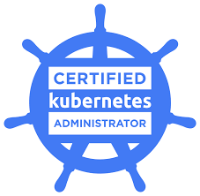

<h2>Bem vindo ao guia rápido para Certified Kubernetes Administrator(CKA)</h2>

Este guia tem por objetivo abordar alguns topicos exigidos na prova de certificação CKA, criação de clusters, manutenção do cluster, segurança são alguns items abordados.

Indice

<a href="./TheHardWay/README.md">1 - Criar cluster kubernetes com kubeadm</a>
