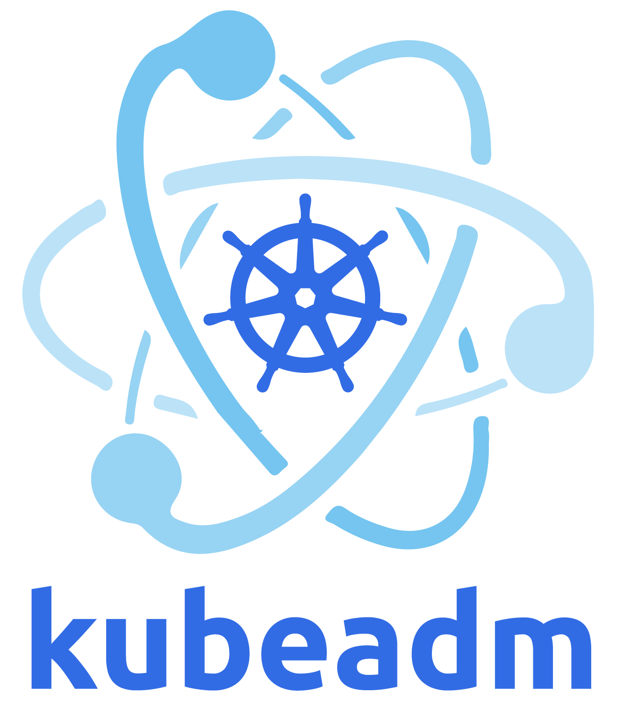

# Criando um cluster kubernetes com kubeadm

## Preparando o ambiente

De acordo com a documentação do kubernetes os requisitos minimos são:

- Linux host
- 2Gb ou mais de memoria RAM
- 2 CPUs ou mais
- Conectividade entre os hosts
- Nome unico, MAC e product_uuid para cada node.
- Swap desabilitado.

Provisionaremos 3 maquinas virtuais(1 master e 2 worker nodes) utilizando o <a href="https://developer.hashicorp.com/vagrant/docs/installation">Vagrant</a>.

Executar seguinte comando no diretorio onde se encontra o arquivo Vagrantfile.

`vagrant up`

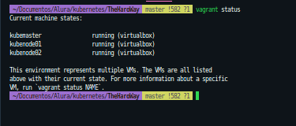

## Kubeadm

O Kubeadm é uma ferramenta criada para fornecer o kubeadm init e o kubeadm join como "caminhos rápidos" de melhores práticas para criar clusters Kubernetes.

O kubeadm executa as ações necessárias para colocar um cluster minimamente viável em funcionamento, e foi projetado para se preocupar apenas com a inicialização e não com o provisionamento de máquinas.

documentação - https://kubernetes.io/docs/setup/production-environment/tools/kubeadm/install-kubeadm/

### Criando o cluster

#### Configurando os Nodes

Os procedimentos abaixo deverão ser realizados em todas as maquinas.

`$ vagrant ssh kubemaster`
`$ vagrant ssh kubenode01`
`$ vagrant ssh kubenode02`

##### Instalando container runtime containerd

Para executar containers nos Pods, kubernetes necessita de um container runtime.

Executar os seguintes comandos para instalação do containerd

```
cat <<EOF | sudo tee /etc/modules-load.d/k8s.conf
overlay
br_netfilter
EOF

sudo modprobe overlay
sudo modprobe br_netfilter

# sysctl params required by setup, params persist across reboots
cat <<EOF | sudo tee /etc/sysctl.d/k8s.conf
net.bridge.bridge-nf-call-iptables  = 1
net.bridge.bridge-nf-call-ip6tables = 1
net.ipv4.ip_forward                 = 1
EOF

# Apply sysctl params without reboot
sudo sysctl --system

```

```

lsmod | grep br_netfilter
lsmod | grep overlay

```

`sysctl net.bridge.bridge-nf-call-iptables net.bridge.bridge-nf-call-ip6tables net.ipv4.ip_forward`

```
# Add Docker's official GPG key:
sudo apt-get update
sudo apt-get install ca-certificates curl gnupg
sudo install -m 0755 -d /etc/apt/keyrings
curl -fsSL https://download.docker.com/linux/ubuntu/gpg | sudo gpg --dearmor -o /etc/apt/keyrings/docker.gpg
sudo chmod a+r /etc/apt/keyrings/docker.gpg

```

```
# Add the repository to Apt sources:
echo \
  "deb [arch="$(dpkg --print-architecture)" signed-by=/etc/apt/keyrings/docker.gpg] https://download.docker.com/linux/ubuntu \
  "$(. /etc/os-release && echo "$VERSION_CODENAME")" stable" | \
  sudo tee /etc/apt/sources.list.d/docker.list > /dev/null
sudo apt-get update

```

`$ sudo apt-get install containerd.io`

Verificando instalação:

`$ systemctl status containerd`

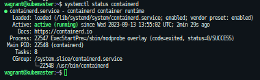

CGroup drivers

Kubelet e container runtime necessitam interagir com control groups(cgroups) para alocar recursos de cpu/memoria para os containers. Existem dois tipos de cgroups drivers: cgroupfs e systemd. Cgroupfs é o padrão mas se o sistema utilizar <b>systemd init system</b> o driver a ser escolhido deverá ser o systemd.

Para verificar init system:

`$ ps -p 1`

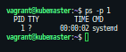

Editar o arquivo /etc/containerd/config.toml com as seguintes informações:

`sudo vi /etc/containerd/config.toml`

```
[plugins."io.containerd.grpc.v1.cri".containerd.runtimes.runc]
  [plugins."io.containerd.grpc.v1.cri".containerd.runtimes.runc.options]
    SystemdCgroup = true

```

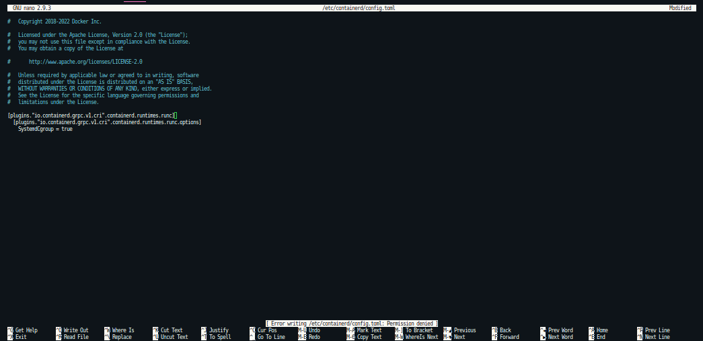

`sudo systemctl restart containerd`

#### Instalando kubeadm, kubelet e kubectl

```
sudo apt-get update
# apt-transport-https may be a dummy package; if so, you can skip that package
sudo apt-get install -y apt-transport-https ca-certificates curl

```

Download da chave publica para repositorio do kubernetes

`curl -fsSL https://pkgs.k8s.io/core:/stable:/v1.28/deb/Release.key | sudo gpg --dearmor -o /etc/apt/keyrings/kubernetes-apt-keyring.gpg`

Em versões anteriores ao Debian 12 e Ubuntu 22.04 o diretorio /etc/apt/keyrings não existe por padrão, para cria-lo basta executar:

`sudo mkdir -m 755 /etc/apt/keyrings`

Adicionando repositorio do kubernetes

`echo 'deb [signed-by=/etc/apt/keyrings/kubernetes-apt-keyring.gpg] https://pkgs.k8s.io/core:/stable:/v1.28/deb/ /' | sudo tee /etc/apt/sources.list.d/kubernetes.list`

Atualizando os pacotes e em seguida instalar kubelet, kubeadm e kubectl

```
sudo apt-get update
sudo apt-get install -y kubelet kubeadm kubectl
sudo apt-mark hold kubelet kubeadm kubectl

```

### Criando o cluster

#### Inicializando o master node

Os comandos abaixo devem ser executados somente no master node!!

`sudo kubeadm init --pod-network-cidr=10.244.0.0/16 --apiserver-advertise-address=192.168.56.2`

--apiserver-advertise-address= IP master node

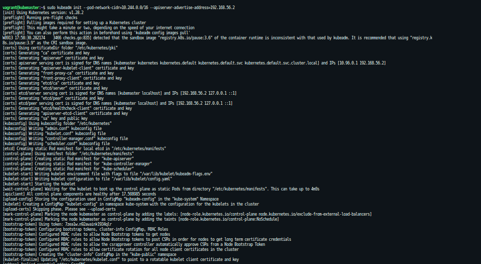

Se o procedimento ocorrer com sucesso aparecerá a seguinte mensagem:

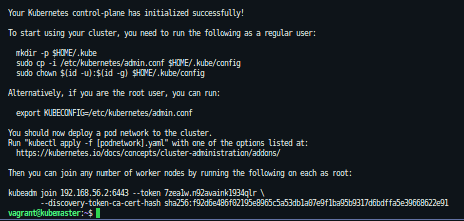

Os seguintes passos são necessarios após o controlplane ser iniciado:

```
mkdir -p $HOME/.kube
sudo cp -i /etc/kubernetes/admin.conf $HOME/.kube/config
sudo chown $(id -u):$(id -g) $HOME/.kube/config

```

Copiar o comando kubeadm join pois precisaremos para inicializar os workers nodes:

`sudo kubeadm join 192.168.56.2:6443 --token 7zea1w.n92avaink1934qlr --discovery-token-ca-cert-hash sha256:f92d6e486f02195e8965c5a53db1a07e9f1ba95b9317d6bdffa5e39668622e91`

Deploy POD network add-on.

É necessario fazer o deploy de CNI Pod network add para que os PODs se possam comunicar. Cluster DNS(CoreDNS) não irá inicializar até que o add-on seja instalado no cluster. Existem varias opçoes como Calico,Weave

Weave Net

`$ kubectl apply -f https://github.com/weaveworks/weave/releases/download/v2.8.1/weave-daemonset-k8s.yaml`

`kubectl get pods -n kube-system -o wide`

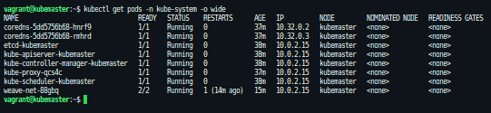

Editar Daemonset do weave-net e adicionar as configurações abaixo:

```
- name: IPALLOC_RANGE
  value: 10.244.0.0/16

```

`kubectl edit daemonset weave-net -n kube-system`

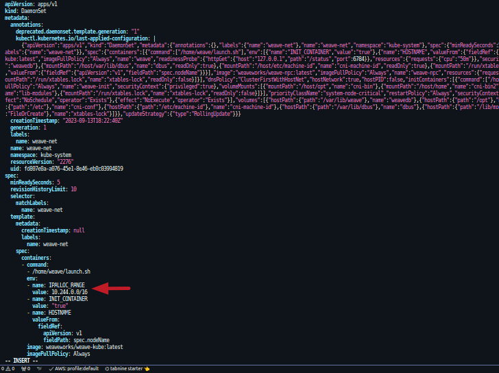

### Join Worker Nodes

Nos worker nodes executar o comando que foi exibido no momento da inicialização do control plane:

`sudo kubeadm join 192.168.56.2:6443 --token 7zea1w.n92avaink1934qlr --discovery-token-ca-cert-hash sha256:f92d6e486f02195e8965c5a53db1a07e9f1ba95b9317d6bdffa5e39668622e91`

Caso não se tenha copiado o comando no momento da inicialização do controlplane basta executar o seguinte comando:

`kubeadm token create --print-join-command`

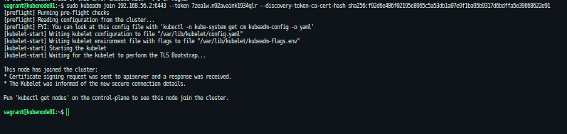

Se tudo ocorrer como esperado teremos nosso cluster com um control-plane e dois worker nodes

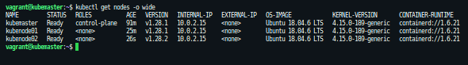

### Limitações

O cluster criado neste exemplo possui somente um control-plane node com um unico etcd database sendo executado nele. Isto significa que uma falha no control-plane pode prejudicar todo o cluster. Por isso é altamente recomendavel:

- Backup regular do ETCD
- Utilizar multiplos control-plane

Documentação:
https://kubernetes.io/docs/setup/production-environment/tools/kubeadm/install-kubeadm/
https://kubernetes.io/docs/setup/production-environment/container-runtimes/
https://docs.docker.com/engine/install/ubuntu/
https://kubernetes.io/docs/setup/production-environment/tools/kubeadm/create-cluster-kubeadm/
